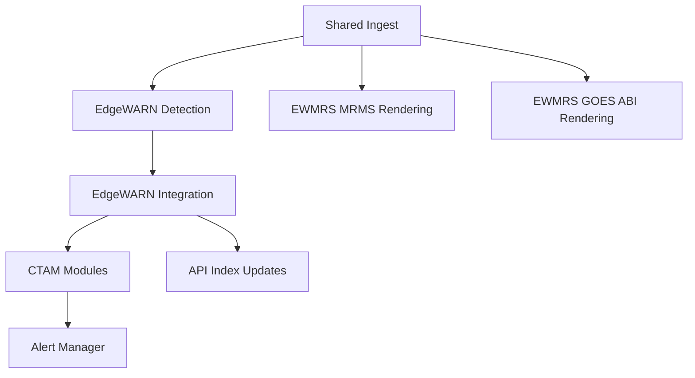

# EdgeWARN Core Runtime Overview

This document summarizes the current runtime architecture implemented under `src/`.

## Runtime Layout

```text
src/
├── run_edgewarn.py                  # Primary EdgeWARN service entry point
├── run_ewmrs.py                     # EWMRS/accessory service entry point
├── run_nexrad.py                    # NEXRAD service entry point
├── run_all.py                       # Optional all-services supervisor
├── run.py                           # Retired; directs callers to split services
├── process_historical.py            # Historical reprocessing entry point
├── api/                             # Unified Node.js HTTP API (app, routes, middleware, services)
├── config/                          # Node YAML catalog loader used by the API
├── util/                            # Shared filesystem, I/O, GRIB, performance, release helpers
├── common/
│   ├── ingest/                      # Shared ingest implementations (MRMS/NWS/Synoptic/METAR/WPC/NEXRAD)
│   │   ├── mrms/                    # MRMS + GOES discovery/download/staging
│   │   ├── nws/                     # NWS active alert ingest + zone sync
│   │   ├── synoptic/                # RAP ingest
│   │   ├── nexrad/                  # NEXRAD Level II ingest + parser
│   │   ├── wpc/                     # WPC surface analysis ingest
│   │   ├── metar.py                 # METAR ingest
│   │   └── aws_async_compat.py      # AWS async/sync compatibility shim
│   ├── config/                      # YAML catalog loader, overlay precedence, validation
│   └── pipeline/                    # Shared staged-ingest coordination (coordinator.py, goes_readiness.py)
├── EdgeWARN/
│   ├── pipeline.py                  # Top-level EdgeWARN orchestration
│   ├── process/detect/              # Storm-cell detection and tracking
│   ├── process/integrate/           # Per-cell data integration pipeline
│   ├── ctam/                        # CTAM framework + modules
│   ├── alerts/                      # EdgeWARN alert schema + manager
│   ├── api_integration/             # API index management for generated files
│   ├── ingest/                      # Compatibility re-exports of shared ingest code
│   ├── schedule/                    # Update-checking and scheduling helpers
│   └── ui/                          # Reserved path; currently only contains repo metadata
└── EWMRS/
    ├── pipeline.py                  # Render pipeline orchestration
    ├── pipeline_config.py           # Accessors for config/ewmrs_pipeline.yaml
    ├── render/                      # Layer rendering and tile generation
    ├── rap/                         # RAP Uint16 conversion pipeline + catalog accessors
    └── colormaps.json               # Internal renderer colormap definitions
```

## High-Level Flow



## Runtime Base Directory

Generated products are written under the configured base directory. For the Python pipelines and the EWMRS API, the default is `~/EdgeWARN_input` on Linux/macOS and `C:\EdgeWARN_input` on Windows.

`filesystem.yaml` is the sole authority for platform defaults. The selected
base directory is CLI, then `EDGEWARN_BASE_DIR`, then legacy `BASE_DIR`, then
YAML; `--config-dir` and `EDGEWARN_CONFIG_DIR` select the complete catalog tree.

The active runtime layout is:

```text
<BASE_DIR>/
├── data/
│   ├── stormcells/                  # detection snapshots and stormcell_index.json
│   ├── cells/                       # per-cell history/API files and cell_index.json
│   ├── Alerts/                      # official NWS and EdgeWARN alert registries/snapshots
│   ├── METAR/                       # hourly METAR snapshots
│   ├── RAP/                         # staged RAP GRIB files for integration/conversion
│   ├── NEXRAD_Level2/               # staged Level II volume artifacts
│   └── <MRMS/GOES product dirs>/     # MRMS, FLASH, GLM, ABI channel inputs
├── gui/
│   ├── <MRMS/GOES product>/          # float16 chunks plus index.json metadata
│   ├── RAP/                         # Uint16 RAP layer folders
│   └── NEXRAD/                      # gzip-compressed polar intermediate fields
└── wpc/surface_analysis/            # WPC surface-analysis GeoJSON
```

## Tandem Readiness Stages

- Detection inputs ready
- EWMRS MRMS inputs ready
- Base EdgeWARN integration inputs ready (both MRMS groups plus raw RAP)
- EWMRS GOES inputs ready
- EdgeWARN integration inputs ready (adds scan-time GLM when enabled)

The GOES EWMRS stage renders the full configured GOES-East ABI set after local ABI readiness is met.
Current outputs include the single-channel GUI products `GOES_ABI_C01` through `GOES_ABI_C16` built from staged `ABI-L1b-RadC` channels. RGB composites are a client-side derivation and are not rendered server-side.

The GOES render path renders each single-channel layer through the shared EWMRS pipeline, then writes the same tiled GUI layout and product-level plus timestamp-level `index.json` contract used by the rest of EWMRS. If a required channel is missing or exceeds the allowed timestamp offset, only the affected layer is skipped.

## Scheduling Modes

- The primary service (`run_edgewarn.py`) runs the staged ingest cycle, releases detection inputs first, publishes durable `mrms-ready`/`rap-ready` records, and drives the EdgeWARN worker; the EWMRS service (`run_ewmrs.py`) consumes those records and renders from their exact paths
- NEXRAD runs entirely as its own service (`run_nexrad.py`), independent of both other services
- `process_historical.py` iterates through a requested UTC time range and runs the historical EdgeWARN flow

Current CLI coverage:

- `run_edgewarn.py`: `--lat_limits`, `--lon_limits`, `--base_dir` / `--base-dir`, `--config-dir`, `--profile`, `--disable-ctam`, `--ctam-module-dir`, `--list-ctam-modules`, `--check-ctam-modules`, `--disable-tracking`, `--disable-polygon-expansion`, `--disable-goes`, `--mrms-core-only`, `--refl-threshold`, `--min-seed-percentage`, `--drop-offset`
- `run_ewmrs.py`: `--base_dir` / `--base-dir`, `--config-dir`, `--profile`, `--disable-metar`, `--disable-nws`, `--disable-wpc`, `--disable-goes`
- `run_nexrad.py`: `--base_dir` / `--base-dir`, `--config-dir`, `--profile`
- `run_all.py`: `--services`, every routed flag above (unset flags are not forwarded), plus `--disable-ewmrs` / `--disable-nexrad` to omit services
- `process_historical.py`: `--start`, `--end`, `--lat`, `--lon`, `--base_dir` / `--base-dir`, `--config-dir`, `--profile`, `--disable-ctam`, `--ctam-module-dir`, `--list-ctam-modules`, `--check-ctam-modules`, `--disable-tracking`, `--disable-polygon-expansion`, `--refl-threshold`, `--min-seed-percentage`, `--drop-offset`
- `common/ingest/nws/zone_sync.py`: `--assets-dir`, `--zone-types`, `--timeout-seconds`, `--max-retries`, `--max-workers`, `--pause-seconds`, `--progress` / `--no-progress`, `--apply`, `--report-path`, `--config-dir`
- `common/ingest/nexrad/main.py`: `--site`, `--volume-id`, `--base-dir`, `--max-candidate-volumes-per-site`, `--config-dir`
- `common/ingest/nexrad/pipeline/` (via `python -m`): `--site` (repeatable), `--base-dir`, `--scan-interval-seconds`, `--completion-interval-seconds`, `--max-candidate-volumes-per-site`, `--config-dir`

The `--profile`, `--disable-*`, and `--progress` switches use
`argparse.BooleanOptionalAction`, so each also accepts its `--no-` form and
falls back to the YAML catalogs when omitted rather than to a literal default.

## Additional References

- `docs/core/ingestion.md`
- `docs/core/service_registry.md`
- `docs/core/goes_pipeline.md`
- `docs/core/detection.md`
- `docs/core/integration.md`
- `docs/ctam/README.md`
- `docs/api/api_endpoints.md`
